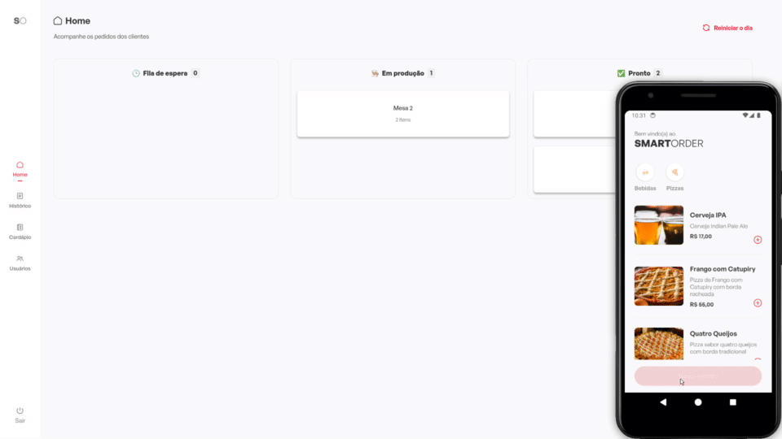
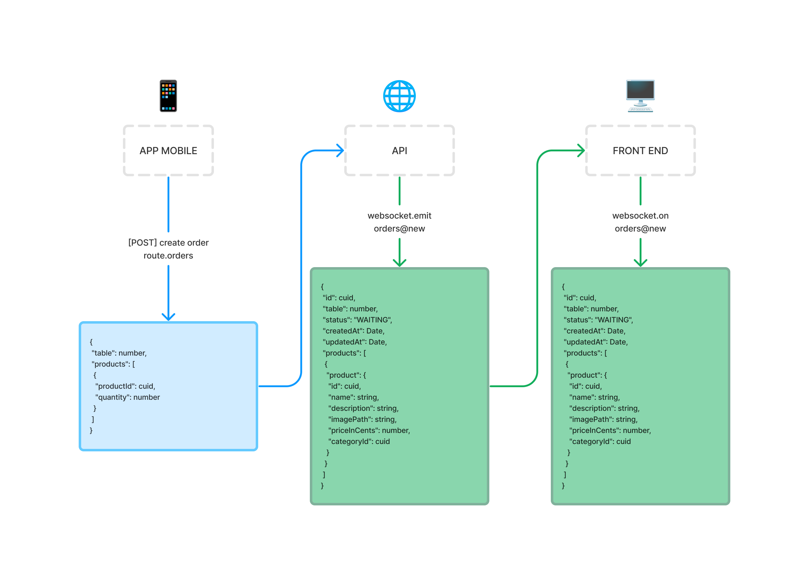

<h1 align="center">
  
</h1>

<p align="center">
 
</p>

<br>

<p align="center">
  
</p>

## 💻 Projeto

O SmartOrder é uma aplicação inovadora projetada para agilizar o processo de atendimento em restaurantes e bares. Com uma interface intuitiva e fácil de usar, SmartOrder permite que os garçons anotem os pedidos dos clientes de forma rápida e eficiente, eliminando a necessidade de anotações em papel e minimizando erros de comunicação.

<h2>🧐 Features</h2>

Aqui estão algumas das melhores features do projeto:

* Acompanhe os pedidos chegando em tempo real
* Listagem dos produtos disponíveis
* Criação de novos produtos
* Edição de produtos já cadastrados
* Deleção de produtos
* Listagem de categorias
* Criação de novas categorias
* Edição de categorias já cadastradas
* Deleção de categorias

<h2>📽 Demonstração</h2>

<p align="center">
  
</p>

<h2>🔀 Fluxo da aplicação</h2>

**1. Usuário Interage com o Aplicativo Mobile:**
  - O usuário abre o aplicativo mobile e interage com a interface para criar um novo produto.

**2. Aplicativo Mobile Faz uma Requisição POST para a API Node:**
  - Quando o usuário conclui a criação do produto, o aplicativo mobile envia uma requisição POST para a API Node.
  - A requisição contém os dados do produto que o usuário deseja criar.

**3. API Node Processa a Requisição e Cria o Produto:**
  - A API Node recebe a requisição POST contendo os dados do produto.
  - A API valida os dados recebidos e cria um novo registro do produto no banco de dados.

**4. API Node Responde via WebSocket para o Frontend Web:**
  - Após criar o produto com sucesso, a API Node envia uma mensagem via WebSocket para o frontend web.
  - A mensagem contém os dados do produto recém-criado.

**5. Frontend Web Recebe e Exibe os Dados do Produto:**
  - O frontend web, que está em constante escuta por mensagens WebSocket, recebe os dados do produto da API.
  - O frontend web atualiza sua interface para exibir o novo produto criado pelo usuário.

<p align="center">
  
</p>

<h2>🛠️ Installation Steps:</h2>

### Configurando o ambiente

Para iniciar a aplicação localmente é necessário ter [Node](https://nodejs.org) e [pnpm](https://pnpm.io) previamente instalados.
Também é necessário estar rodando a API do projeto: [SmartOrder API](https://github.com/lucianogmoraesjr/smartorder-api)

### Instalando as dependências

Para instalar as dependências do projeto, rode o comando:

```bash
$ pnpm install
```
### Iniciando a aplicação

Para iniciar a aplicação, rode o comando:

```bash
$ pnpm dev
```

A aplicação por padrão está rodando em: http://localhost:5173

## 🚀 Built with

Tecnologias utilizadas no projeto:

- [![React][react]][react-url]
- [![Vite][vite]][vite-url]
- [![TypeScript][typescript]][typescript-url]
- [![React Hook Form][hook-form]][hook-form-url]
- [![styled-components][styled-components]][styled-components-url]

<!-- MARKDOWN LINKS & IMAGES -->
[react]: https://img.shields.io/badge/React%20-%20%2320232A?style=for-the-badge&logo=React&labelColor=20232a
[react-url]: https://react.dev/
[vite]: https://img.shields.io/badge/Vite%20-%20%2320232A?style=for-the-badge&logo=Vite&labelColor=20232a&logoColor=fff
[vite-url]: https://vitejs.dev
[typeScript]: https://img.shields.io/badge/TypeScript-20232A?style=for-the-badge&logo=TypeScript&logoColor=%233178C6&labelColor=20232A
[typescript-url]: https://www.typescriptlang.org/
[hook-form]: https://img.shields.io/badge/React%20Hook%20Form%20-%2020232A?style=for-the-badge&logo=React%20Hook%20Form&logoColor=%23fff&color=%2320232A
[hook-form-url]: https://www.react-hook-form.com/
[styled-components]: https://img.shields.io/badge/styled%20components%20-%2020232A?style=for-the-badge&logo=styled-components&logoColor=%23fff&color=%2320232A
[styled-components-url]: https://www.styled-components.com/
