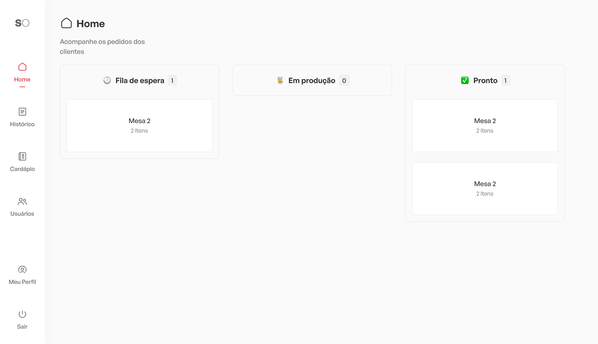

<h1 align="center">
  
</h1>

 

 

  

## 💻 Projeto

O SmartOrder é uma aplicação inovadora projetada para agilizar o processo de atendimento em restaurantes e bares. Com uma interface intuitiva e fácil de usar, SmartOrder permite que os garçons anotem os pedidos dos clientes de forma rápida e eficiente, eliminando a necessidade de anotações em papel e minimizando erros de comunicação.

<h2>🧐 Features</h2>

Aqui estão algumas das melhores features do projeto:

* Acompanhe os pedidos chegando em tempo real
* Listagem dos produtos disponíveis (WIP)
* Criação de novos produtos (WIP)
* Edição de produtos já cadastrados (WIP)

<h2>🛠️ Installation Steps:</h2>

1. Wip

  
## 🚀 Built with

Tecnologias utilizadas no projeto:

* [![ReactJS][React.js]][React-url]
* [![styled-components][styled-components]][styled-components-url]

<!-- MARKDOWN LINKS & IMAGES -->
[React.js]: https://img.shields.io/badge/ReactJS-20232A?style=for-the-badge&logo=react&logoColor=61DAFB
[React-url]: https://reactjs.org/
[styled-components]: https://img.shields.io/badge/styledcomponents-DB7093?style=for-the-badge&logo=styledcomponents&logoColor=fff
[styled-components-url]: https://styled-components.com/
